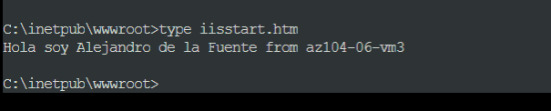
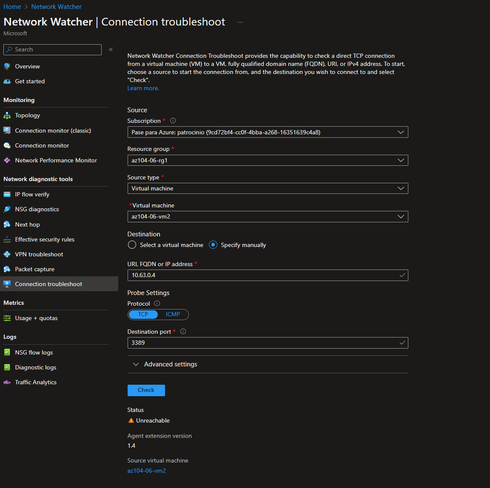
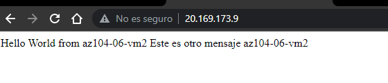

# Lab 05 - Implement Intersite Connectivity

*20 de Enero de 2023*

## Objetivos

- **Task 1**: Aprovisionar el entorno de laboratorio.
- **Task 2**: Configurar la topología de red hub and spoke.
- **Task 3**: Probar la transitividad del emparejamiento de redes virtuales.
- **Task 4**: Configurar el enrutamiento en la topología hub and spoke.
- **Task 5**: Implementar Azure Load Balancer.
- **Task 6**: Implementar Azure Application Gateway.

## Diagrama de arquitectura

## Instrucciones

### TASK 1: Aprovisionar el entorno de laboratorio.

1. Iniciamos sesión en el [portal de Azure](https://portal.azure.com/) .

2. Después abrimos nuestro **Terminal** y conectamos nuestra cuenta de Azure.

3. Una vez que hayamos iniciado sesión tendremos que ir a la ubicación donde se encuentra nuestros .json (**az104-06-vms-loop-template.json** y **az104-06-vms-loop-parameters.json**).

4. Ejecutqaremos lo siguiente para crear el primer grupo de recursos que hospedará el entorno de laboratorio (reemplace el marcador de posición '[Azure_region]' con el nombre de una región de Azure en la que pretende implementar máquinas virtuales de Azure) en nuestro caso sera **eastus**:

    `$location = '[Azure_region]'`

5. Ahora el nombre del grupo de recursos:

    `$rgName = 'az104-06-rg1'`

6. Y finalmente creamos el grupo de recursos en la ubicación deseada:

    `New-AzResourceGroup -Name $rgName -Location $location`

7. Ejecutaremos lo siguiente para crear las tres redes virtuales y las cuatro máquinas virtuales de Azure en ellas usando la plantilla y los archivos de parámetros que tenemos:

   `New-AzResourceGroupDeployment` 

   `   -ResourceGroupName $rgName `  

   `-TemplateFile $HOME/az104-06-vms-loop-template.json `  

   `-TemplateParameterFile $HOME/az104-06-vms-loop-parameters.json`

   

8. Una vez que hagamos esto nos iremos a nuestro Azure portal y comprobamos que tengan el servidor web. Para ello nos iremos a nuestro grupo de recursos (**az104-06-rg1**) y nos iremos a nuestra maquina virtual 3. Después haremos click en **Serial console**. Tendremos que activar el **Boot diagnostics** seleccionando la opción recomendada que nos marca y le damos a **Save**.

9. Después introduciremos el siguiente comando para ver en que canal estamos:

   `cmd` 

   Cuando veamos en que canal estamos tendremos que poner el siguiente comando:

   `ch -si <#>`  ----->donde # tendremos que poner el número de nuestro canal.

   Después tendremos que introducir nuestro username: **Student** y nuestro domain en este caso: **az0104-06-vm3**.

   Cuando iniciemos sesión, ejecutaremos el siguiente comando:

   `cd inetpub` > `cd wwwroot` > `copy con iisstart.htm`

   Ahora podemos escribir lo que queramos que más adelante se mostrará, en nuestro caso escribiremos: Hello from *nuestro nombre* from Az104-06-vm3.

   Para comprobar que se ha ejecutado correctamente, ejecutaremos el siguiente comando:

   `type iisstart.htm`

   

10. Volveremos a nuestro **Terminal** y ejecutaremos lo siguiente para instalar la extensión Network Watcher en las máquinas virtuales de Azure implementadas en el paso anterior:

    `$rgName = 'az104-06-rg1'` 

    `$location = (Get-AzResourceGroup -ResourceGroupName $rgName).location` 

    `$vmNames = (Get-AzVM -ResourceGroupName $rgName).Name` 

    `foreach ($vmName in $vmNames) {`  

    `Set-AzVMExtension` 

    `-ResourceGroupName $rgName`  

    `-Location $location` 

    `-VMName $vmName`  

    `-Name 'networkWatcherAgent'` 

    `-Publisher 'Microsoft.Azure.NetworkWatcher'`  

    `-Type 'NetworkWatcherAgentWindows'`  

    `-TypeHandlerVersion '1.4' }`

    

### TASK 2: Configurar la topología de red hub and spoke.

1. En Azure Portal, buscamos y seleccionamos **Virtual nets** .

2. Revisamos las redes virtuales que creamos en la tarea anterior.

3. En la lista de redes virtuales, seleccionamos **az104-06-vnet2** .

4. En la hoja **az104-06-vnet2** , seleccionamos **Properties** .

5. En el **az104-06-vnet2 | Properties**, tendremos que copiar y guardarnos el valor de **Resource ID**, ya que nos hara falta mas adelante.

6. Volvemos a la lista de redes virtuales y seleccionamos **az104-06-vnet3** .

7. En la hoja **az104-06-vnet3** , seleccionamos **Properties** .

8. En el **az104-06-vnet3 | Properties**, tendremos que copiar y guardarnos el valor de **Resource ID**, ya que nos hara falta mas adelante.

9. En la lista de redes virtuales, hacemos clic en **az104-06-vnet01** .

10. En la hoja de red virtual **az104-06-vnet01** , en la sección **Settings**, haga clic en **Peerings** y luego hacemos clic en **+ Add** .

11. Agregamos un emparejamiento con la siguiente configuración (dejando lo demás con sus valores predeterminados) y hacemos clic en **Add** :

    | Setting                                       | Value                                                        |
    | :-------------------------------------------- | :----------------------------------------------------------- |
    | This virtual network: Peering link name       | **az104-06-vnet01_to_az104-06-vnet2**                        |
    | Traffic to remote virtual network             | **Allow (default)**                                          |
    | Traffic forwarded from remote virtual network | **Block traffic that originates from outside this virtual network** |
    | Virtual network gateway                       | **None (default)**                                           |
    | Remote virtual network: Peering link name     | **az104-06-vnet2_to_az104-06-vnet01**                        |
    | Virtual network deployment model              | **Resource manager**                                         |
    | I know my resource ID                         | enabled                                                      |
    | Resource ID                                   | the value of resourceID parameter of **az104-06-vnet2** you recorded earlier in this task |
    | Traffic to remote virtual network             | **Allow (default)**                                          |
    | Traffic forwarded from remote virtual network | **Allow (default)**                                          |
    | Virtual network gateway                       | **None (default)**                                           |

12. En la hoja de red virtual **az104-06-vnet01** , en la sección **Settings**, hacemos clic en **Peerings**  y luego hacemos clic en **+ Add** .

13. Agregamos un emparejamiento con la siguiente configuración (dejando lo demás con sus valores predeterminados) y hacemos clic en **Add** :

    | Setting                                       | Value                                                        |
    | :-------------------------------------------- | :----------------------------------------------------------- |
    | This virtual network: Peering link name       | **az104-06-vnet01_to_az104-06-vnet3**                        |
    | Traffic to remote virtual network             | **Allow (default)**                                          |
    | Traffic forwarded from remote virtual network | **Block traffic that originates from outside this virtual network** |
    | Virtual network gateway                       | **None (default)**                                           |
    | Remote virtual network: Peering link name     | **az104-06-vnet3_to_az104-06-vnet01**                        |
    | Virtual network deployment model              | **Resource manager**                                         |
    | I know my resource ID                         | enabled                                                      |
    | Resource ID                                   | the value of resourceID parameter of **az104-06-vnet3** you recorded earlier in this task |
    | Traffic to remote virtual network             | **Allow (default)**                                          |
    | Traffic forwarded from remote virtual network | **Allow (default)**                                          |
    | Virtual network gateway                       | **None (default)**                                           |

### TASK 3: Probar la transitividad del emparejamiento de redes virtuales.

1. En Azure Portal, buscamos y seleccionamos **Network Watcher** .

2. En la hoja de **Network Watcher** , expandimos la lista de regiones de Azure y verificamos que el servicio esté habilitado en la región que está utilizando.

3. En la hoja de **Network Watcher** , vamos a **Connection troubleshoot**.

4. En **Network Watcher - Connection troubleshoot** , iniciamos una verificación con las siguientes configuraciones (deje otras con sus valores predeterminados):

   | Setting           | Value                                                        |
   | :---------------- | :----------------------------------------------------------- |
   | Subscription      | the name of the Azure subscription you are using in this lab |
   | Resource group    | **az104-06-rg1**                                             |
   | Source type       | **Virtual machine**                                          |
   | Virtual machine   | **az104-06-vm0**                                             |
   | Destination       | **Specify manually**                                         |
   | URI, FQDN or IPv4 | **10.62.0.4**                                                |
   | Protocol          | **TCP**                                                      |
   | Destination Port  | **3389**                                                     |

5. **10.62.0.4** representa la dirección IP privada de **az104-06-vm2**.

6. Hacemos clic en **Check** y esperamos hasta que se devuelvan los resultados de la verificación de conectividad. Verificamos que el estado sea **Reachable**. Revisamos la ruta de la red y observamos que la conexión fue directa, sin saltos intermedios entre las máquinas virtuales.

7. En **Network Watcher - Connection troubleshoot** , iniciamos una verificación con las siguientes configuraciones (dejamos otras con sus valores predeterminados):

   | Setting           | Value                                                        |
   | :---------------- | :----------------------------------------------------------- |
   | Subscription      | the name of the Azure subscription you are using in this lab |
   | Resource group    | **az104-06-rg1**                                             |
   | Source type       | **Virtual machine**                                          |
   | Virtual machine   | **az104-06-vm0**                                             |
   | Destination       | **Specify manually**                                         |
   | URI, FQDN or IPv4 | **10.63.0.4**                                                |
   | Protocol          | **TCP**                                                      |
   | Destination Port  | **3389**                                                     |

8. **10.63.0.4** representa la dirección IP privada de **az104-06-vm3**.

9. Hacemos clic en **Check** y esperamos hasta que se devuelvan los resultados de la verificación de conectividad. Verificamos que el estado sea **Reachable**. Revisamos la ruta de la red y observamos que la conexión fue directa, sin saltos intermedios entre las máquinas virtuales.

10. En **Network Watcher - Connection troubleshoot** , iniciamos una verificación con las siguientes configuraciones (dejamos otras con sus valores predeterminados):

    | Setting           | Value                                                        |
    | :---------------- | :----------------------------------------------------------- |
    | Subscription      | the name of the Azure subscription you are using in this lab |
    | Resource group    | **az104-06-rg1**                                             |
    | Source type       | **Virtual machine**                                          |
    | Virtual machine   | **az104-06-vm2**                                             |
    | Destination       | **Specify manually**                                         |
    | URI, FQDN or IPv4 | **10.63.0.4**                                                |
    | Protocol          | **TCP**                                                      |
    | Destination Port  | **3389**                                                     |

11. Hacemos clic en **Check** y esperamos hasta que se devuelvan los resultados de la verificación de conectividad. Verificamos que el estado sea **Reachable**.

### TASK 4: Configurar el enrutamiento en la topología hub and spoke.

En esta tarea, configuraremos y probaremos el enrutamiento entre las redes virtuales de dos radios habilitando el reenvío de IP en la interfaz de red de la máquina virtual **az104-06-vm0** , habilitando el enrutamiento dentro de su sistema operativo y configurando rutas definidas por el usuario en el radio. red virtual

1. En Azure Portal, buscamos y seleccionamos **Virtual machines** .
2. En la hoja **Virtual machines** , en la lista de máquinas virtuales, hacemos clic en **az104-06-vm0** .
3. En **az104-06-vm0** , en la sección **Settings**, hacemos clic en **Networking**.
4. Hacemos clic en el **az104-06-nic0** junto a la etiqueta de la **Network interface** y luego, en la hoja de la interfaz de red **az104-06-nic0** , en la sección **Settings**, hacemos clic en **IP configurations**.
5. Establezca **IP forwarding** en **Enabled** y guardamos el cambio.

6. En Azure Portal, volvemos a la hoja de la máquina virtual de Azure **az104-06-vm0** y hacemos clic **Overview**.

7. En la hoja **az104-06-vm0** , en la sección **Operations**, hacemos clic en **Run command** y, en la lista de comandos, hacemos clic en **RunPowerShellScript**.

8. En la hoja **Run Command Script** , escribiremos lo siguiente y hacemos clic en **Run** para instalar la función de servidor de Windows de acceso remoto.

   `Install-WindowsFeature RemoteAccess -IncludeManagementTools`

   

9. En la hoja **Run Command Script**, escribimos lo siguiente y hacemos clic en **Run**  para instalar el servicio de función de enrutamiento.

   `Install-WindowsFeature -Name Routing -IncludeManagementTools -IncludeAllSubFeature` 

   `Install-WindowsFeature -Name "RSAT-RemoteAccess-Powershell"` 

   `Install-RemoteAccess -VpnType RoutingOnly` 

   `Get-NetAdapter | Set-NetIPInterface -Forwarding Enabled`

   

10. En Azure Portal, buscamos y seleccionamos **Route tables** y, en la hoja **Route tables**, hacemos clic en **+ Create**.

11. Creamos una tabla de rutas con la siguiente configuración (deje las demás con sus valores predeterminados):

    | Setting                  | Value                                                        |
    | :----------------------- | :----------------------------------------------------------- |
    | Subscription             | the name of the Azure subscription you are using in this lab |
    | Resource group           | **az104-06-rg1**                                             |
    | Location                 | the name of the Azure region in which you created the virtual networks |
    | Name                     | **az104-06-rt23**                                            |
    | Propagate gateway routes | **No**                                                       |

12. Hacemos clic **Review and Create**. Hacemos clic en **Create** para enviar su implementación.

13. Hacemos clic en **Go to resource** .

14. En la hoja de la tabla de rutas **az104-06-rt23** , en la sección **Settings**, hacemos clic en **Routes** y luego hacemos clic en **+ Add**.

15. Agregamos una nueva ruta con la siguiente configuración:

    | Setting                              | Value                             |
    | :----------------------------------- | :-------------------------------- |
    | Route name                           | **az104-06-route-vnet2-to-vnet3** |
    | Address prefix destination           | **IP Addresses**                  |
    | Destination IP addresses/CIDR ranges | **10.63.0.0/20**                  |
    | Next hop type                        | **Virtual appliance**             |
    | Next hop address                     | **10.60.0.4**                     |

16. Hacemos clic en **Add**

17. De vuelta en la hoja de la tabla de rutas **az104-06-rt23** , en la sección **Settings**, hacemos clic en **Subnets** y luego hacemos clic en **+ Associate**.

18. Asociamos la tabla de rutas **az104-06-rt23** con la siguiente subred:

    | Setting         | Value              |
    | :-------------- | :----------------- |
    | Virtual network | **az104-06-vnet2** |
    | Subnet          | **subnet0**        |

19. Hacemos clic en **Add**

20. Vuelva a la hoja **Route tables** y hacemos clic en **Create**.

21. Creamos una tabla de rutas con la siguiente configuración (dejamos las demás con sus valores predeterminados):

    | Setting                  | Value                                                        |
    | :----------------------- | :----------------------------------------------------------- |
    | Subscription             | the name of the Azure subscription you are using in this lab |
    | Resource group           | **az104-06-rg1**                                             |
    | Region                   | the name of the Azure region in which you created the virtual networks |
    | Name                     | **az104-06-rt32**                                            |
    | Propagate gateway routes | **No**                                                       |

22. Hacemos clic en **Review and Create**. Dejamos que se produzca la validación y pulsamos **Create** para enviar su implementación.

23. Hacemos clic **Go to resource** .

24. En la hoja de la tabla de rutas **az104-06-rt32** , en la sección **Settings** , hacemos clic en **Routes** y luego hacemos clic en **+ Add** .

25. Agregamos una nueva ruta con la siguiente configuración:

    | Setting                              | Value                             |
    | :----------------------------------- | :-------------------------------- |
    | Route name                           | **az104-06-route-vnet3-to-vnet2** |
    | Address prefix destination           | **IP Addresses**                  |
    | Destination IP addresses/CIDR ranges | **10.62.0.0/20**                  |
    | Next hop type                        | **Virtual appliance**             |
    | Next hop address                     | **10.60.0.4**                     |

26. Hacemos clic en **OK**.

27. De vuelta en la hoja de la tabla de rutas **az104-06-rt32** , en la sección **Settings**, hacemos clic en **Subnets** y luego hacemos clic en **+ Associate** .

28. Asociamos la tabla de rutas **az104-06-rt32** con la siguiente subred:

    | Setting         | Value              |
    | :-------------- | :----------------- |
    | Virtual network | **az104-06-vnet3** |
    | Subnet          | **subnet0**        |

29. Hacemos clic en **OK**

30. En Azure Portal, volvemos a la hoja  **Network Watcher - Connection troubleshoot**.

31. En  **Network Watcher - Connection troubleshoot**, iniciamos una verificación con las siguientes configuraciones (dejamos otras con sus valores predeterminados):

    | Setting           | Value                                                        |
    | :---------------- | :----------------------------------------------------------- |
    | Subscription      | the name of the Azure subscription you are using in this lab |
    | Resource group    | **az104-06-rg1**                                             |
    | Source type       | **Virtual machine**                                          |
    | Virtual machine   | **az104-06-vm2**                                             |
    | Destination       | **Specify manually**                                         |
    | URI, FQDN or IPv4 | **10.63.0.4**                                                |
    | Protocol          | **TCP**                                                      |
    | Destination Port  | **3389**                                                     |

32. Hacemos clic en **Check**  y esperamos hasta que se devuelvan los resultados de la verificación de conectividad. Verificamos que el estado sea **Reachable**. Revisamos la ruta de la red y tenemos que tener en cuenta que el tráfico se enrutó a través de **10.60.0.4** , asignado al adaptador de red **az104-06-nic0** . Si el estado es **Unreachable**, debemos detener y luego iniciar az104-06-vm0.

    > **Nota: Tuvimos un problema y nos daba Unrechable cuando intentabamos conectarnos entre la vm2 y la vm3.
    >
    > 
    >
    > Tuvimos que realizar los siguientes cambios para solucionar el problema.
    >
    > 

### TASK 5: Implementar Azure Load Balancer.

1. En Azure Portal, buscamos y seleccionamos **Load balancers** y, en la hoja **Load balancers**, hacemos clic en **+ Create**.

2. Crearemos un balanceador de carga con la siguiente configuración (deje los demás con sus valores predeterminados) y luego hacemos clic en **Next : Frontend IP configuration**:

   | Setting        | Value                                                        |
   | :------------- | :----------------------------------------------------------- |
   | Subscription   | the name of the Azure subscription you are using in this lab |
   | Resource group | **az104-06-rg4**                                             |
   | Name           | **az104-06-lb4**                                             |
   | Region         | name of the Azure region into which you deployed all other resources in this lab |
   | SKU            | **Standard**                                                 |
   | Type           | **Public**                                                   |
   | Tier           | **Regional**                                                 |

3. En la pestaña **Frontend IP configuration**, hacemos clic en **Add a frontend IP configuration** y usamos la siguiente configuración antes de hacer clic en **OK**  y luego en **Add**. Cuando haya terminado, hacemos clic en **Next: Backend pools**.

   | Setting           | Value             |
   | :---------------- | :---------------- |
   | Name              | **az104-06-pip4** |
   | IP version        | IPv4              |
   | IP type           | IP address        |
   | Public IP address | **Create new**    |
   | Availability zone | **No Zone**       |

   

4. En la pestaña Grupos de back-end, hacemos clic en **Add a backend pool** con la siguiente configuración (dejamos los demás con sus valores predeterminados). Hacemos clic en **+ Add**  (dos veces) y luego hacemos clic en **Next:Inbound rules**.

   | Setting                                | Value                |
   | :------------------------------------- | :------------------- |
   | Name                                   | **az104-06-lb4-be1** |
   | Virtual network                        | **az104-06-vnet01**  |
   | Backend Pool Configuration             | **NIC**              |
   | IP Version                             | **IPv4**             |
   | Click **Add** to add a virtual machine |                      |
   | az104-06-vm0                           | **check the box**    |
   | az104-06-vm1                           | **check the box**    |

5. En la pestaña **Inbound rules**, hacemos clic en **Add a load balancing rule**. Agregamos una regla de equilibrio de carga con la siguiente configuración (dejando las demás con sus valores predeterminados). Cuando haya terminado, hacemos clic en **Add**.

   | Setting                                            | Value                    |
   | :------------------------------------------------- | :----------------------- |
   | Name                                               | **az104-06-lb4-lbrule1** |
   | IP Version                                         | **IPv4**                 |
   | Frontend IP Address                                | **az104-06-pip4**        |
   | Backend pool                                       | **az104-06-lb4-be1**     |
   | Protocol                                           | **TCP**                  |
   | Port                                               | **80**                   |
   | Backend port                                       | **80**                   |
   | Health probe                                       | **Create new**           |
   | Name                                               | **az104-06-lb4-hp1**     |
   | Protocol                                           | **TCP**                  |
   | Port                                               | **80**                   |
   | Interval                                           | **5**                    |
   | Unhealthy threshold                                | **2**                    |
   | Close the create health probe window               | **OK**                   |
   | Session persistence                                | **None**                 |
   | Idle timeout (minutes)                             | **4**                    |
   | TCP reset                                          | **Disabled**             |
   | Floating IP                                        | **Disabled**             |
   | Outbound source network address translation (SNAT) | **Recommended**          |

6. Luego hacemos clic en **Review and create**. Luego hacemos clic en **Create** .

7. Esperamos a que se implemente el balanceador de carga y luego hacemos clic **Go to resource**.

8. Seleccionamos **Frontend IP configuration** en la página de recursos de **Load Balancer**. Copiamos la dirección IP.

9. Abrimos otra pestaña del navegador y navegamos hasta la dirección IP. Verificamos que la ventana del navegador muestra el mensaje **Hello World from az104-06-vm0** o **Hello World from az104-06-vm1**.

   

10. Actualizamos la ventana para verificar que el mensaje cambia a la otra máquina virtual. Esto demuestra la rotación del balanceador de carga a través de las máquinas virtuales.

    

### TASK 6: Implementar Azure Application Gateway.

1. En Azure Portal, buscamos y seleccionamos **Virtual networks** .

2. En la hoja **Virtual networks** , en la lista de redes virtuales, hacemos clic en **az104-06-vnet01** .

3. En la hoja de red virtual **az104-06-vnet01** , en la sección **Settings** , hacemos clic en **Subnets** y luego hacemos clic en **+ Subnet**.

4. Agregamos una subred con la siguiente configuración (deje las demás con sus valores predeterminados):

   | Setting              | Value              |
   | :------------------- | :----------------- |
   | Name                 | **subnet-appgw**   |
   | Subnet address range | **10.60.3.224/27** |

5. Hacemos clic en **Save**.

6. En Azure Portal, buscamos y seleccionamos **Application Gateways** y, en la hoja de **Application Gateways , hacemos clic en + Create**.

7. En la pestaña **Basics** , especificamos las siguientes configuraciones (dejamos las demás con sus valores predeterminados):

   | Setting                  | Value                                                        |
   | :----------------------- | :----------------------------------------------------------- |
   | Subscription             | the name of the Azure subscription you are using in this lab |
   | Resource group           | **az104-06-rg5** (create new)                                |
   | Application gateway name | **az104-06-appgw5**                                          |
   | Region                   | name of the Azure region into which you deployed all other resources in this lab |
   | Tier                     | **Standard V2**                                              |
   | Enable autoscaling       | **No**                                                       |
   | Instance count           | **2**                                                        |
   | Availability zone        | **None**                                                     |
   | HTTP2                    | **Disabled**                                                 |
   | Virtual network          | **az104-06-vnet01**                                          |
   | Subnet                   | **subnet-appgw (10.60.3.224/27)**                            |

8. Hacemos clic en **Next: Frontends >** y especificamos la siguiente configuración (dejando los demás con sus valores predeterminados). Cuando termine, hacemos clic en **OK**.

   | Setting                  | Value             |
   | :----------------------- | :---------------- |
   | Frontend IP address type | **Public**        |
   | Public IP address        | **Add new**       |
   | Name                     | **az104-06-pip5** |
   | Availability zone        | **None**          |

9. Hacemos clic  **Next: Backends >**  y luego **Add a backend pool** . Especificamos las siguientes configuraciones (dejando las demás con sus valores predeterminados). Cuando haya terminado, hacemos clic en **Add** .

   | Setting                          | Value                   |
   | :------------------------------- | :---------------------- |
   | Name                             | **az104-06-appgw5-be1** |
   | Add backend pool without targets | **No**                  |
   | IP address or FQDN               | **10.62.0.4**           |
   | IP address or FQDN               | **10.63.0.4**           |

10. Hacemos clic en **Next: Configuration >** y luego en **+ Add a routing rule**. Especificamos la siguiente configuración:

    | Setting        | Value                     |
    | :------------- | :------------------------ |
    | Rule name      | **az104-06-appgw5-rl1**   |
    | Priority       | **10**                    |
    | Listener name  | **az104-06-appgw5-rl1l1** |
    | Frontend IP    | **Public**                |
    | Protocol       | **HTTP**                  |
    | Port           | **80**                    |
    | Listener type  | **Basic**                 |
    | Error page url | **No**                    |

11. Cambiamos a la pestaña **Backend targets** y especificamos la siguiente configuración (dejando los demás con sus valores predeterminados). Cuando haya terminado, hacemos clic en **Add** (dos veces).

    | Setting               | Value                     |
    | :-------------------- | :------------------------ |
    | Target type           | **Backend pool**          |
    | Backend target        | **az104-06-appgw5-be1**   |
    | Backend settings      | **Add new**               |
    | Backend settings name | **az104-06-appgw5-http1** |
    | Backend protocol      | **HTTP**                  |
    | Backend port          | **80**                    |
    | Additional settings   | **take the defaults**     |
    | Host name             | **take the defaults**     |

12. Hacemos clic en **Next: Tags >**, seguido de **Next: Review + create >** y luego hacemos clic en **Create**.

13. En Azure Portal, buscamos y seleccionamos **Application Gateways** y, en la hoja de **Application Gateways , haga clic en** **az104-06-appgw5** .

14. En la hoja de Application Gateway **az104-06-appgw5** , copiamos el valor de la **Frontend public IP address**.

15. Iniciamos otra ventana del navegador y navegamos hasta la dirección IP que identificamos en el paso anterior.

16. Verificamos que la ventana del navegador muestra el mensaje **Hello World from az104-06-vm2** o **Hello World from az104-06-vm3** .

    

17. Actualizamos la ventana para verificar que el mensaje cambia a la otra máquina virtual.

    

